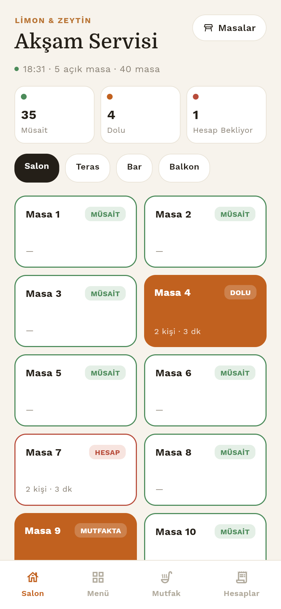
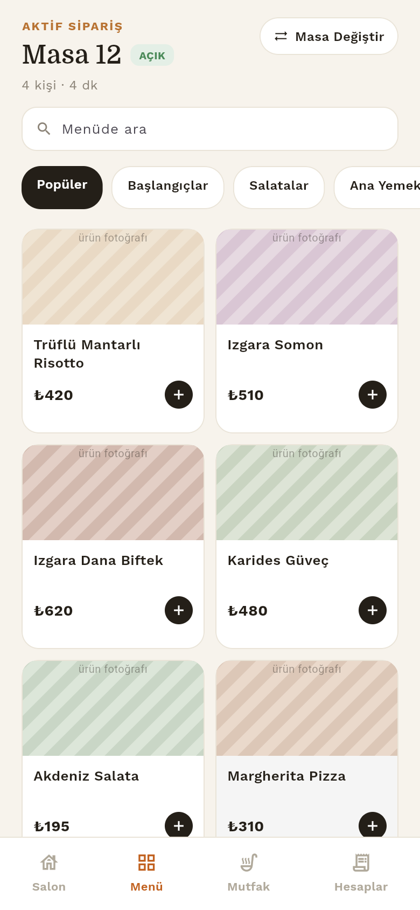
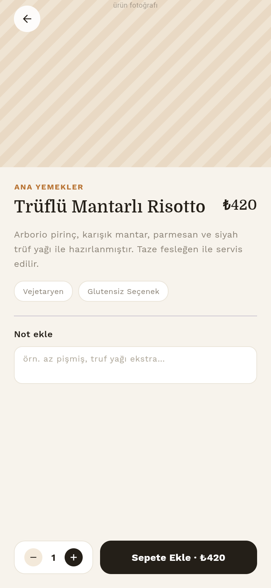
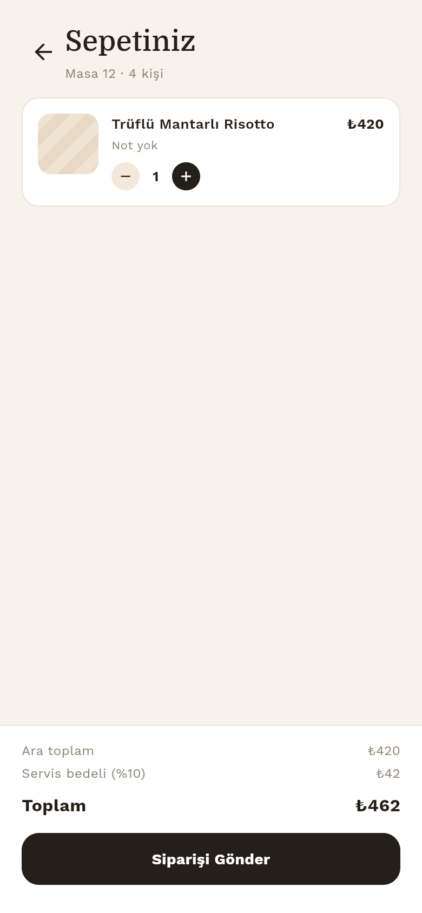
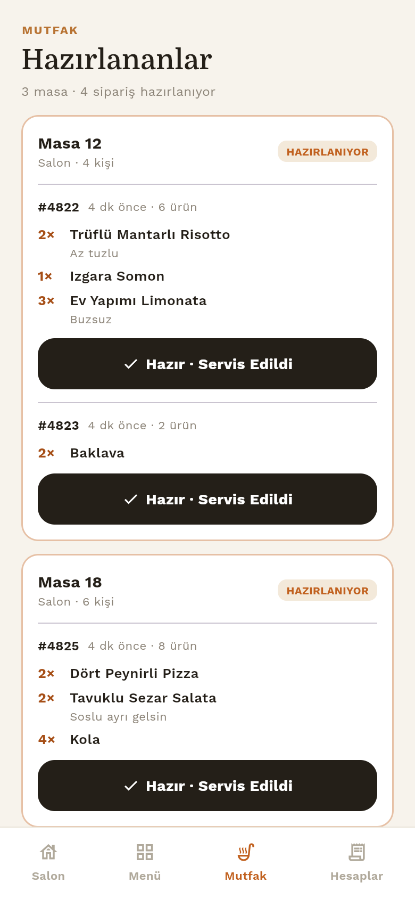
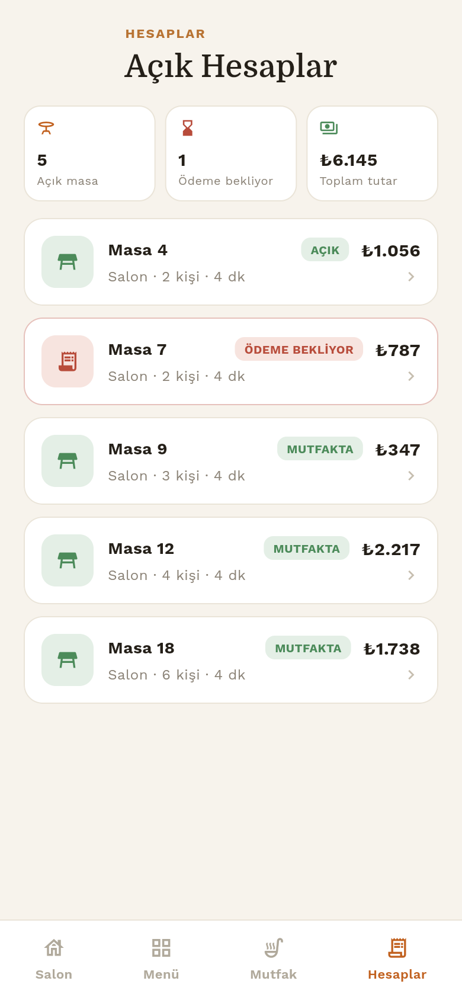
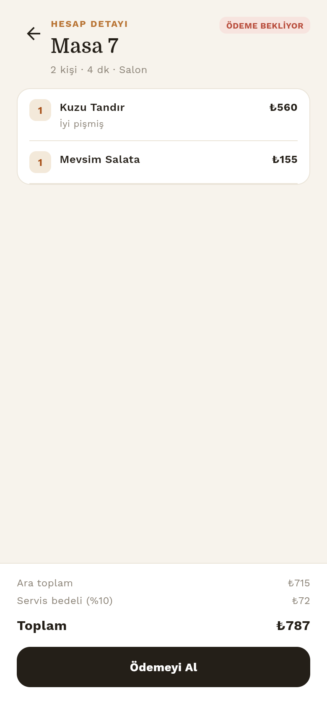
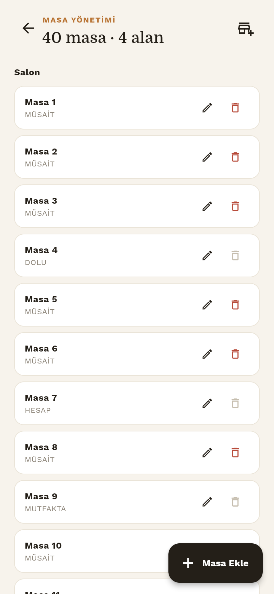
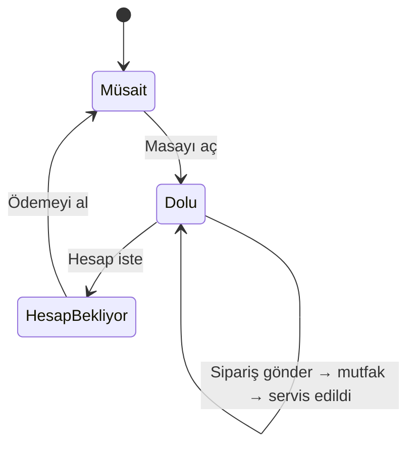
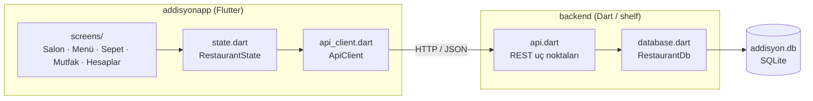

# Limon & Zeytin — Restoran Sipariş Yönetimi

Bir restoranın salonundaki **masa → mutfak → hesap → ödeme** döngüsünü tek bir
uygulamadan yönetmek için geliştirilmiş adisyon uygulaması. Garson masayı açar,
menüden sipariş girer, sipariş anında mutfak ekranına düşer; mutfak hazır
olduğunu işaretler, garson hesabı ister ve ödemeyi alır.

Proje iki parçadan oluşur:

| Parça | Klasör | Görevi |
|---|---|---|
| **Mobil / web arayüzü** | [`addisyonapp/`](addisyonapp) | Flutter ile yazılmış garson ve mutfak arayüzü |
| **REST API** | [`backend/`](backend) | Dart (`shelf`) ile yazılmış sunucu, verileri SQLite'ta tutar |

<p align="center">
  
</p>

## Amaç

Küçük ve orta ölçekli restoranlarda kâğıt adisyon ve sözlü sipariş aktarımı;
karışıklığa, geç servise ve hesap hatalarına yol açar. Bu uygulama şunları hedefler:

- Hangi masanın **müsait, dolu ya da hesap bekliyor** olduğunu anlık görmek
- Siparişi **notlarıyla birlikte** (ör. "az tuzlu") doğrudan mutfağa iletmek
- Mutfakta bekleyen siparişleri **masa bazında** takip etmek
- Hesabı otomatik hesaplamak (ara toplam + %10 servis bedeli) ve ödemeyi kapatmak
- Salon, teras, bar gibi **alanları ve masaları** kod değiştirmeden yönetmek

## Ekran görüntüleri

<table>
  <tr>
    <td align="center"><br><b>Salon</b><br><sub>Masa durumları, alan filtresi ve özet</sub></td>
    <td align="center"><br><b>Menü</b><br><sub>Kategoriler, arama ve hızlı ekleme</sub></td>
    <td align="center"><br><b>Ürün detayı</b><br><sub>Açıklama, etiketler, not ve adet</sub></td>
  </tr>
  <tr>
    <td align="center"><br><b>Sepet</b><br><sub>Servis bedeli dahil toplam ve sipariş gönderme</sub></td>
    <td align="center"><br><b>Mutfak</b><br><sub>Hazırlanan siparişler, "Hazır · Servis Edildi"</sub></td>
    <td align="center"><br><b>Hesaplar</b><br><sub>Açık hesaplar ve toplam tutar</sub></td>
  </tr>
  <tr>
    <td align="center"><br><b>Hesap detayı</b><br><sub>Kalemler, servis bedeli ve ödeme alma</sub></td>
    <td align="center"><br><b>Masa yönetimi</b><br><sub>Masa ekle, düzenle, sil; alan ekle</sub></td>
    <td></td>
  </tr>
</table>

> Görüntüler örnek verilerle alınmıştır. Ürün fotoğrafları henüz eklenmediği için
> ürün görselleri yer tutucu desenlerle gösterilir.

## Özellikler

- **Salon görünümü** — Masalar alanlara (Salon, Teras, Bar, Balkon) göre listelenir;
  müsait / dolu / hesap bekliyor sayıları üstte özetlenir.
- **Masa açma** — Müsait masaya dokunmak masayı açar ve doğrudan menüye götürür.
- **Menü ve sepet** — 40'tan fazla ürün, kategori filtresi, arama, ürün başına not
  ve adet. Aynı ürün + aynı not tek satırda birleşir.
- **Mutfak ekranı** — Sipariş gönderilince mutfakta masa bazında görünür. Ekran
  10 saniyede bir kendini yeniler; başka bir cihazdan gelen siparişler de düşer.
- **Hesap ve ödeme** — Hesap yalnızca dolu bir masa için istenebilir, ödeme yalnızca
  hesap istendikten sonra alınabilir. Ödeme sonrası masa tekrar müsait olur.
- **Masa yönetimi** — Masa ve alan ekleme, yeniden adlandırma. Açık hesabı olan masa
  silinemez.
- **Hata yönetimi** — Sunucuya ulaşılamazsa anlaşılır Türkçe mesaj ve "Tekrar Dene".

## Masa yaşam döngüsü



Bir sipariş mutfağa `preparing` olarak düşer; mutfak "Hazır · Servis Edildi"
dediğinde `served` olur ve mutfak listesinden çıkar.

## Teknolojiler

| Katman | Teknoloji | Kullanım amacı |
|---|---|---|
| Arayüz | **Flutter 3.35** / **Dart 3.9** | Tek kod tabanıyla Android, iOS ve web arayüzü |
| Durum yönetimi | [`provider`](https://pub.dev/packages/provider) | `RestaurantState` (ChangeNotifier) ile tek durum kaynağı |
| Ağ | [`http`](https://pub.dev/packages/http) | REST API istemcisi, zaman aşımı ve hata çevirisi |
| Tipografi | [`google_fonts`](https://pub.dev/packages/google_fonts) | Başlıklarda **Domine**, gövdede **Work Sans** |
| Sunucu | **Dart** + [`shelf`](https://pub.dev/packages/shelf), [`shelf_router`](https://pub.dev/packages/shelf_router) | REST API, CORS ve hata yönetimi |
| Veritabanı | **SQLite** ([`sqlite3`](https://pub.dev/packages/sqlite3)) | Tek dosyalık (`addisyon.db`) kalıcı veri |
| Test | `flutter_test` | Uygulama açılışı ve uçtan uca akış testleri (3 ekran boyutu) |

## Mimari



```
.
├── addisyonapp/                 # Flutter arayüzü
│   ├── lib/
│   │   ├── main.dart            # Uygulama girişi, Provider kurulumu
│   │   ├── state.dart           # Tek durum kaynağı (masalar, menü, sepet, mutfak)
│   │   ├── api_client.dart      # Backend ile HTTP iletişimi
│   │   ├── models.dart          # Masa, ürün, sepet, hesap, mutfak modelleri
│   │   ├── theme.dart           # "Limon & Zeytin" renk paleti ve yazı stilleri
│   │   ├── navigation.dart      # Alt sekmeler arası geçiş
│   │   ├── screens/             # Salon, menü, sepet, mutfak, hesaplar, masa yönetimi
│   │   └── widgets/             # Alt gezinme çubuğu ve ortak bileşenler
│   └── test/                    # Widget ve akış testleri
├── backend/                     # REST API
│   ├── bin/server.dart          # Sunucu girişi
│   └── lib/                     # api.dart, database.dart, seed_data.dart, native_sqlite.dart
└── docs/screenshots/            # Bu dosyadaki ekran görüntüleri
```

Arayüz veriyi yalnızca `RestaurantState` üzerinden okur; durum sınıfı da tüm
değişiklikleri API'ye iletir. Fiyat, servis bedeli ve mutfak sayıları backend
tarafında hesaplanır, arayüz sadece gösterir.

## Kurulum ve çalıştırma

**Gereksinimler:** Flutter SDK (Dart `^3.9.2` ile birlikte gelir).

**1. Backend'i başlat**

```bash
cd backend
dart pub get
dart run bin/server.dart
```

Sunucu `http://localhost:8080` adresinde açılır. İlk çalıştırmada veritabanı
otomatik oluşturulur ve 4 alan, 40 masa ve menü ile doldurulur. Ayrıntılar ve
API listesi için [`backend/README.md`](backend/README.md).

**2. Uygulamayı başlat** (yeni bir terminalde, proje klasöründen)

```bash
cd addisyonapp
flutter pub get
flutter run -d chrome      # web
flutter run                # bağlı cihaz veya emülatör
```

Android emülatöründe adres otomatik `http://10.0.2.2:8080` olur. **Gerçek bir
telefondan** denerken bilgisayarın yerel ağ adresini vermek gerekir (telefon ve
bilgisayar aynı Wi-Fi'da olmalı; backend açılırken "Ağda" satırında adresi yazar):

```bash
flutter run --dart-define=API_BASE_URL=http://192.168.x.x:8080
```

**3. Testler**

```bash
cd addisyonapp
flutter test
```

## Bilinen sınırlar

- API'de kimlik doğrulama yoktur; yalnızca güvenilir yerel ağda kullanım için uygundur.
- Ürün fotoğrafları yoktur, yer tutucu desen gösterilir.
- Mutfak ekranı anlık bildirim yerine 10 saniyelik yenileme (polling) kullanır.
- Servis bedeli %10 sabittir; para birimi ₺'dir ve tutarlar tam sayı olarak tutulur.
